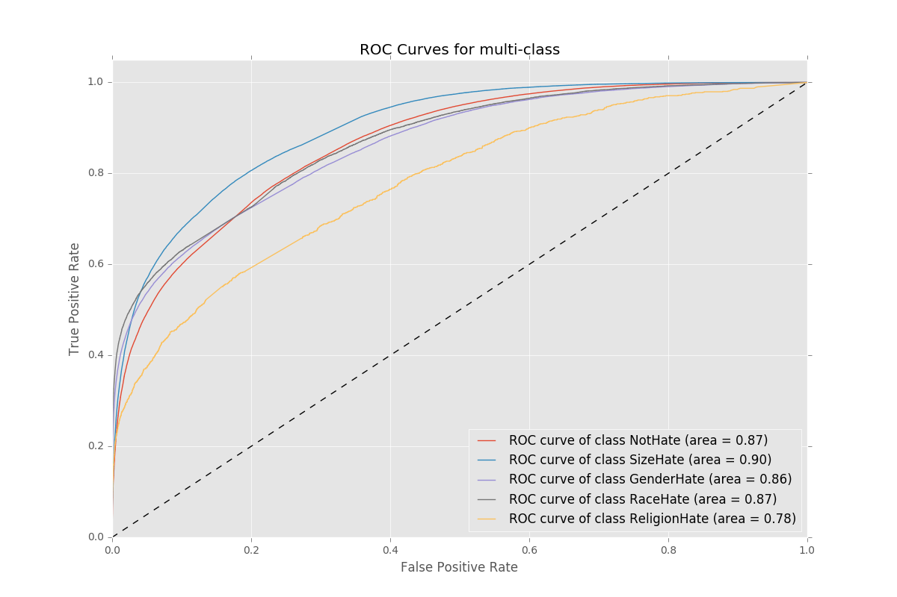
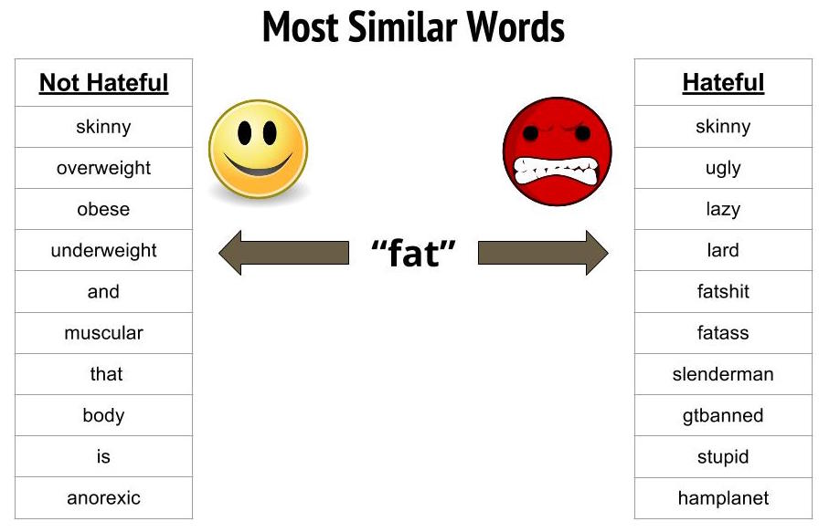
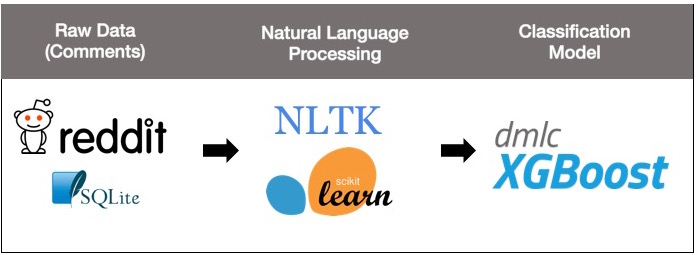

# Online Hate Speech
---

This project is an examination of online hate speech, using public comments from reddit.com as the data source.

[Link to slides from 4/28 presentation of project!](https://docs.google.com/presentation/d/12Wfk2dyfDdNhtCdCFBYXg5HzlsPw96mrMaxFGYEss78/edit?usp=sharing)

I developed a computer model to classify text as hate speech or not. If a comment was considered hateful, the model returns what type of hate the comment reflects, between race, gender, religion, and body size. I additionally developed models to examine the relationships between words used in the hateful  and not hateful comment sets. The code is not currently optimized.

### Table Of Contents:

- [Definition & motivation](https://github.com/eyspahn/OnlineHateSpeech#definition--motivation)
- [Results](https://github.com/eyspahn/OnlineHateSpeech#results)
- [Practical Application](https://github.com/eyspahn/OnlineHateSpeech#practical-application)
- [Data Source](https://github.com/eyspahn/OnlineHateSpeech#data-source)
- [Technical Details](https://github.com/eyspahn/OnlineHateSpeech#technical-details)
- [Assumptions](https://github.com/eyspahn/OnlineHateSpeech#assumptions)
- [References](https://github.com/eyspahn/OnlineHateSpeech#references)
- [Resources](https://github.com/eyspahn/OnlineHateSpeech#resources)
- [Acknowledgements](https://github.com/eyspahn/OnlineHateSpeech#acknowledgements)

## Definition & Motivation

Hate speech is broadly defined as speech advocating incitement to harm based on the target's membership in a group. Examples would be speech against those of a certain religion, race, or gender. (UNESCO 2015) Hate speech seeks to amplify and propagate existing social tensions and sends two types of messages: 1) to diminish or dehumanize members of a group, and 2) to reinforce the in-group against the perceived threat. (Waldron 2012)
 
Online spaces have made it very easy for people of a wide variety of backgrounds to exchange ideas freely and often in an anonymous way. In many cases, this prompts a wonderful exchange of ideas. Unfortunately, a few people take this as a chance to be inflammatory against groups of other people.

This is a problem because this will potentially turn off a lot of your users. If you're a site that features reviews, like Yelp or Amazon, you'll want to filter out hateful content so the rest of your users won't be driven away by offensive content. This means that companies pay a lot, in time and money, to monitor their content.

The predictive model developed here is one approach to automate part of the moderating process.

## Results

### Classification Modeling:

The model I developed classifies text into five categories of speech, one not hateful, and four different types of hate speech. The model has a misclassification rate (# wrong classes / # all cases) of 23%, meaning that more than 3/4 of the time, the model classifies the text correctly. This includes misclassifications between different types of hate speech.

A better measure of the model has an Area Under the Curve (AUC) of the ROC curve ranging from 0.78 to 0.90. (The closer to 1, the better a model performs.) The table below lists the classes of speech and the averaged AUC score after five-fold cross validation.

| Class | Average AUC score |
| :---: | :---:|
| Not Hateful | 0.866 |
| Hateful against Body Size | 0.897 |
| Hateful against Gender | 0.862 |
| Hateful against Race | 0.868 |
| Hateful against Religion | 0.778 |

I have plotted AUC curves from the cross-validation results. One example is shown here.

A web application including the predictor is forthcoming.

### Word Embeddings:

In this case, I developed two Word2Vec models, one for the hateful comments and another for the not hateful comments. This is a tool of examining the "word embeddings," and I used this to probe the different vocabularies used in the hateful and not hateful comments.

I removed punctuation and turned the words into lowercase, but I did not stem the words, and I did not remove stop words. The example below shows the results when the models are probed for the most similar words to "fat" in each of the models.

## Practical Application

I can see two potential use cases in production:

- **Pre-screen comments** The model could run on comments after they're submitted but before they're published. It could flag potentially inflammatory comments, and prevent a hateful comment from being posting until approved by a human moderator.

- **Iconize a recent history of hateful comments** Alternatively, this could provide a public label. A user's avatar color could change, or have letters superimposed on it, in response to the model predicting hateful speech. A user could have an indication of hating women, for example, and other users of the site could easily identify this user as hating women, and choose to weight the hateful user's comments accordingly. This would require less human moderation, but may have unintended consequences, such as hateful users finding each other via their hateful labels.

## Data Source

The data source I used for this project was comments from [reddit]( https://www.reddit.com/). A user had scraped all the publicly available comments and published them.
[Original link](https://www.reddit.com/r/datasets/comments/3bxlg7/i_have_every_publicly_available_reddit_comment/ )
 Kaggle published the May 2015 reddit data in a Sqlite database available for download.  [ Kaggle link to Reddit comments ]( https://www.kaggle.com/c/reddit-comments-may-2015 ) Another reddit user had uploaded the data to Google's BigQuery, making it easy to obtain a subset of the full reddit comments data. [BigQuery Link to Reddit Comments](https://bigquery.cloud.google.com/dataset/fh-bigquery:reddit_comments)
 

## Technical Details

I used TF-IDF with xgboost to classify comments as not hateful, or one of 4 dimensions of hate speech (race, religion, gender, body size). ___Comments were determined to be one of those 5 categories if they appeared in subreddits which were determined to be hateful or not hateful___

Table of final hateful & not hateful subreddits used:

| Hate or Not Category | Subreddit Name | Number of comments|
|:----: | :---: | :----: |
| Hate: Race | /r/CoonTown | 51979 |
| Hate: Race  | /r/WhiteRights | 1352 |
| Hate: Gender | /r/Trans_fags | 2362 |
| Hate: Gender | /r/SlutJustice | 309 |
| Hate: Gender | /r/TheRedPill | 59145 |
| Hate: Gender | /r/KotakuInAction | 128156 |
| Hate: Religion | /r/IslamUnveiled | 5769 |
| Hate: Religion | /r/GasTheKikes | 919 |
| Hate: Religion | /r/AntiPOZi | 4740 |
| Hate: Body Size | /r/fatpeoplehate | 311183 |
| Hate: Body Size | /r/TalesofFatHate | 5239 |
| Not Hate | /r/politics | 244927 |
| Not Hate | /r/worldnews | 490354 |
| Not Hate | /r/history | 25242 |
| Not Hate | /r/blackladies | 4396 |
| Not Hate | /r/lgbt | 8253 |
| Not Hate | /r/TransSpace | 472 |
| Not Hate | /r/women | 529 |
| Not Hate | /r/TwoXChromosomes | 105130 |
| Not Hate | /r/DebateReligion | 41015 |
| Not Hate | /r/religion | 2623 |
| Not Hate | /r/islam | 25443 |
| Not Hate | /r/Judaism | 9103 |
| Not Hate | /r/BodyAcceptance | 579 |
| Not Hate | /r/fatlogic | 54525 |

I created a TF-IDF matrix from the May 2015 comments from the hateful and not-hateful subreddits previously identified. This was about 1.57 million comments, and resulted in a vocabulary of over 450,000 words. I lowercased letters, stripped words of punctuation, and applied a snowball stemmer during the tokenization process.

I used the classification package in XGBoost to develop the final multi-class model. Initially, I ran a multinomial Naïve-Bayes model in SK-learn, which returned an average ROC AUC score of about 0.75.

The XGBoost model improved significantly on multinomial Naïve Bayes, and after some parameter tuning, cross-validation  returned an average ROC AUC score of 0.86.
The misclassification error for all the classes (the number of misclassified comments divided by the total number of comments) was 23%. This means that over 3/4 of the test comments were classified correctly.

The models were developed on Amazon EC2 instances, as the processing power/memory required for both the vectorization of the comments into the tf-idf matrix and the training of the classification model were quite significant.

## Assumptions

There are a whole lot of assumptions in this analysis.

#### Labeling Hate
The biggest assumption I'm making has to do with labeling the data as hateful or not.

In this analysis, I used the subreddit the comment came from as the marker as hateful or not hateful. The benefit of this approach is that nobody needs to expose themselves to potentially hateful speech. However, this is not a very rigorous approach--that is, there are likely many comments which would not be considered hateful other than appearing in one of the hateful subreddits.

I relied on the assumption that hateful and not-hateful data would both contain controversial information and back-and-forth exchanges between members. This may account for irony and sarcasm as well, if those appear in both hateful and not hateful subreddits.

#### Multiple simultaneous categories are not accounted for;
The categorization may be fluid as well. Certainly, people can express hate in multiple dimensions simultaneously (e.g. "That chink bitch"), but this model will only predict one category.

In the above example, I suspect that since there are more hateful comments in the gender category to train the model, that is the category the model will predict.

#### Potentially incorrect categorization
I included hateful speech regarding sexual orientation as part of hateful speech against gender. This is not entirely appropriate, but the relatively small number of hateful comments I found against sexual orientation, combined with expected conflation between gender and sexual orientation by those who are hateful against them, made me feel grudgingly comfortable including sexual orientation into the gender hate category.

#### Selecting Subreddits
I selected the subreddits manually. I researched what potentially hateful subreddits were, starting with some googling. Among the sources were news articles which discussed the revision of anti-harassment policy in the months after May 2015, which I took to be a good indicator of potential hate speech.

I started with a list of about 70 potientially hateful  subreddits. I examined these subreddits in the May 2015 comments database, and checked that the subreddit had more than 100 comments and that it was actually a hateful subreddit. These led me to the final list of
11 hateful subreddits with over 500,000 comments in them.

I then wanted to choose subreddits which would cover similar content while being strictly moderated to remove any hateful speech. I also wanted to include some general subreddits which would have a lot of arguments and cover general non-hateful speech. This let me to the final list of non-hateful subreddits, of just over a million comments.

#### The labeling approach not taken:
A more rigorous way to approach labeling is to use crowdsourcing tools like Amazon Mechanical Turk or Crowdflower, to have people read and label comments individually. I had pursued this approach; however, I wasn't satisfied with this system for the project. There were two main reasons: the initial model based on the subreddit labeling method performed better than I expected, and also the costs for manual labeling

The main reason this approach was abandoned was cost concerns--without a budget for the project, I wanted to keep costs minimal.

It cost about $8 for a set of 100 comments to be labeled three times by different people. Of these, nearly 2/3 were labeled as "not hateful," despite the comments originating from only hateful subreddits and screening for comment length. Continuing at this rate, it would be over $100 for a corpus of 2000 labeled comments, of which perhaps a third would be considered hateful.

#### Speech is not uniform

Another large assumption is that the hate speech encountered on reddit is similar to hate speech in general. This may be very wrong--it may be that there are site-specific or subreddit-specific phrases the subreddit(s) involved, not hate speech generally. For example, on /r/fatpeoplehate, the term "hamplanet" was often used when discussing larger-shaped people. This term appears to originate, or at least be popularized by reddit, though Urban Dictionary's definitions do not reference the site.

## References

Benech, S, 2012. "Words As Weapons"
http://www.worldpolicy.org/journal/spring2012/words-weapons

Buckels, E.E. et al, 2014. "Trolls just want to have fun." Personality and Individual Differences, Vol 67, pp 97-102

Burnap, P. and Williams, M. (2015) ‘Cyber Hate Speech on Twitter: An Application of Machine Classification and Statistical Modeling for Policy and Decision Making’, Policy & Internet. Vol. 7:2
http://onlinelibrary.wiley.com/doi/10.1002/poi3.85/abstract

Gagliardone, I., et.al. "Countering Online Hate Speech", UNESCO, 2015
http://unesdoc.unesco.org/images/0023/002332/233231e.pdf

Goodman E. and Cherubini, F. "Online Comment Moderation: emerging best practices" World Association of Newspapers (WAN-IFRA) 2013

UMATI project and report
http://www.ihub.co.ke/research/projects/23
http://research.ihub.co.ke/uploads/2013/june/1372415606__936.pdf

"The Harm in Hate Speech," Jeremy Waldron, 2012, Harvard University Press
http://www.hup.harvard.edu/catalog.php?isbn=9780674065895

## Resources

[Southern Poverty Law Center](https://www.splcenter.org/issues/hate-and-extremism)

[Dangerous Speech Project](http://dangerousspeech.org)

[Anti-Defamation League](http://www.adl.org)

## Acknowledgements

- My instructors & peers in the Galvanize Data Science Immersive program.
- Reddit user Stuck_In_the_Matrix for originally scraping & posting the comments. His/her post originally got me thinking about the possibilities in the reddit comment data set.
- Kaggle for hosting the May 2015 comments in a convenient format.
- Reddit user fhoffa for uploading the comments to google big query for easy web-based access of comments
- The people who have spent time developing sci-kit learn, NLP, XGBoost and the many tools I relied on.
